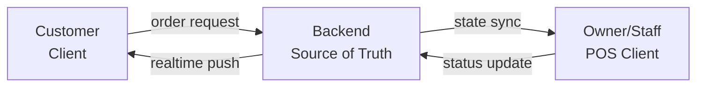
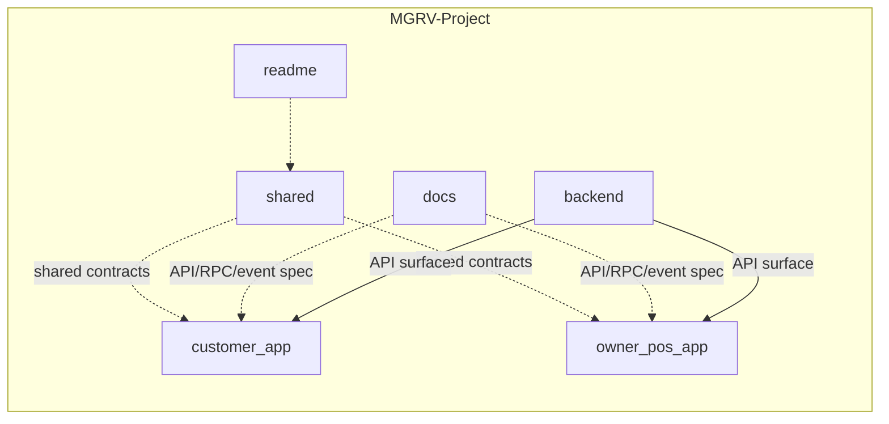
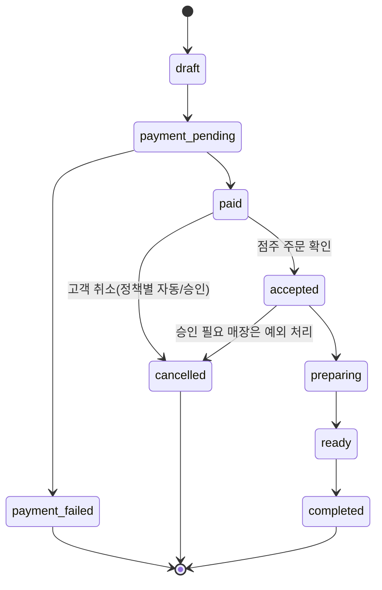

<h1>MGRV Project</h1>

매장 픽업 주문 도메인을 다루는 멀티 클라이언트 · 백엔드 시스템

  <a href="#repositories">Repositories</a>
  ·
  <a href="#research">Research</a>
  ·
  <a href="#architecture">Architecture</a>
  ·
  <a href="#order-pipeline">Order Pipeline</a>
  ·
  <a href="#scope">Scope</a>

---

## What is this, really?

고객용 클라이언트와 매장 운영용 클라이언트가 동일한 주문 파이프라인을 공유한다. 백엔드가 상태 전이와 접근 제어의 단일 진실 공급원(source of truth) 역할을 하고, 두 클라이언트는 같은 도메인 모델과 계약을 공유하되 각자의 화면과 운영 흐름은 독립적으로 갖는다.

실제 매장인 Mangrove 휘경 1호점의 픽업 주문을 자동화하기 위해 만든다. 카페 매니저가 반복적으로 하던 주문 접수·재고 차감·카드 정산을 시스템이 대신 처리하고, 매니저는 예외 처리와 의사결정에 집중하도록 만드는 것이 목표다 — 어떤 업무가 자동화 대상인지의 근거는 [cafe-manager-research-audit](https://github.com/MGRV-Project/cafe-manager-research-audit)에서 조사했다.

## Stuff this system does

- 고객 주문을 접수와 동시에 매장 운영 클라이언트에 실시간으로 반영한다
- 주문 상태는 백엔드가 강제하는 단일 파이프라인을 따른다 — 클라이언트가 상태를 직접 바꾸지 않는다
- 클라이언트 간 공유 계약(shared contracts)으로 도메인 모델 일관성을 유지한다

---

## Platforms

| 클라이언트 | 대상 | 플랫폼 |
|---|---|---|
| Customer | 주문자 | Web/PWA · iOS · Android |
| Owner/Staff POS | 매장 운영 | iPadOS |

**왜 이 스택인가**

- Flutter 하나로 고객 앱의 Web/PWA·iOS·Android를 유지해 로직 중복을 없앤다
- Supabase Realtime으로 주문 상태 변경을 고객·POS 양쪽에 즉시 반영한다
- Supabase RLS로 고객·직원·점주의 접근 범위를 DB 레벨에서 분리한다

## Repositories

| 레포 | 역할 |
|---|---|
| [customer_app](https://github.com/MGRV-Project/customer_app) | 고객용 클라이언트 |
| [owner_pos_app](https://github.com/MGRV-Project/owner_pos_app) | 매장 운영용 POS 클라이언트 |
| [backend](https://github.com/MGRV-Project/backend) | 백엔드 |
| [shared](https://github.com/MGRV-Project/shared) | 클라이언트 간 공유 설계 자산 |
| [docs](https://github.com/MGRV-Project/docs) | API/RPC/이벤트 등 인터페이스 계약 스펙 |
| [readme](https://github.com/MGRV-Project/readme) | 프로젝트 개요 원문 |

---

## Research

시스템을 만들기 전에 "누구를 위한 시스템인가"와 "어디에 놓을 것인가"를 조사한 리서치 레포. 코드가 아니라 의사결정 근거를 담는다.

| 레포 | 역할 |
|---|---|
| [cafe-manager-research-audit](https://github.com/MGRV-Project/cafe-manager-research-audit) | 카페 매니저 직무 리서치 + AX(자동화) 전환 시 자동화되는 업무/남는 업무 매핑 |
| [raw_data](https://github.com/MGRV-Project/raw_data) | 1호점 입지 상권·생활인구·대중교통 데이터 |

---

## Architecture

## Order Pipeline

**MVP 핵심 흐름**

1. 고객이 메뉴 선택
2. 서버가 주문 금액 계산
3. 고객 결제
4. 서버가 결제 승인·검증
5. POS에 신규 주문 표시
6. 직원이 접수 → 제조 → 픽업 준비 완료
7. 고객 수령 → 완료

실제 백엔드가 강제하는 주문 상태 전이로 펼치면 아래와 같다. 결제 완료(`paid`) 전까지는 시스템이 자동 처리하고, 그 이후(`accepted` 이후 준비·픽업과 취소 예외)는 매장이 직접 판단한다.

---

## Scope

| In scope | Out of scope (MVP) |
|---|---|
| 매장 픽업 주문 단일 플로우 | 배달, 락커 연동, 멤버십, 공용시설, 입주민 인증 |

MVP는 결제·재고·알림 같은 핵심 파이프라인을 먼저 안정화하는 게 우선이라 범위를 매장 픽업 하나로 좁혔다. 다음 단계는 입주민 인증(거주자 대상 신원 확인) 연동이다.

## What it is not

- 배달 플랫폼이 아니다
- 멤버십·구독 시스템이 아니다
- 다점포 운영 도구는 아직 아니다 — 후속 단계

---

MGRV Project

