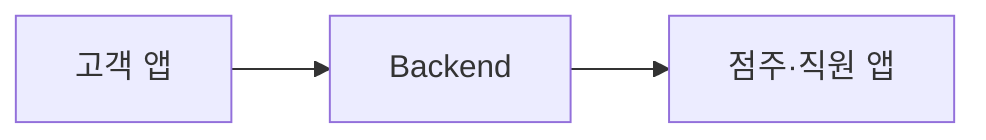
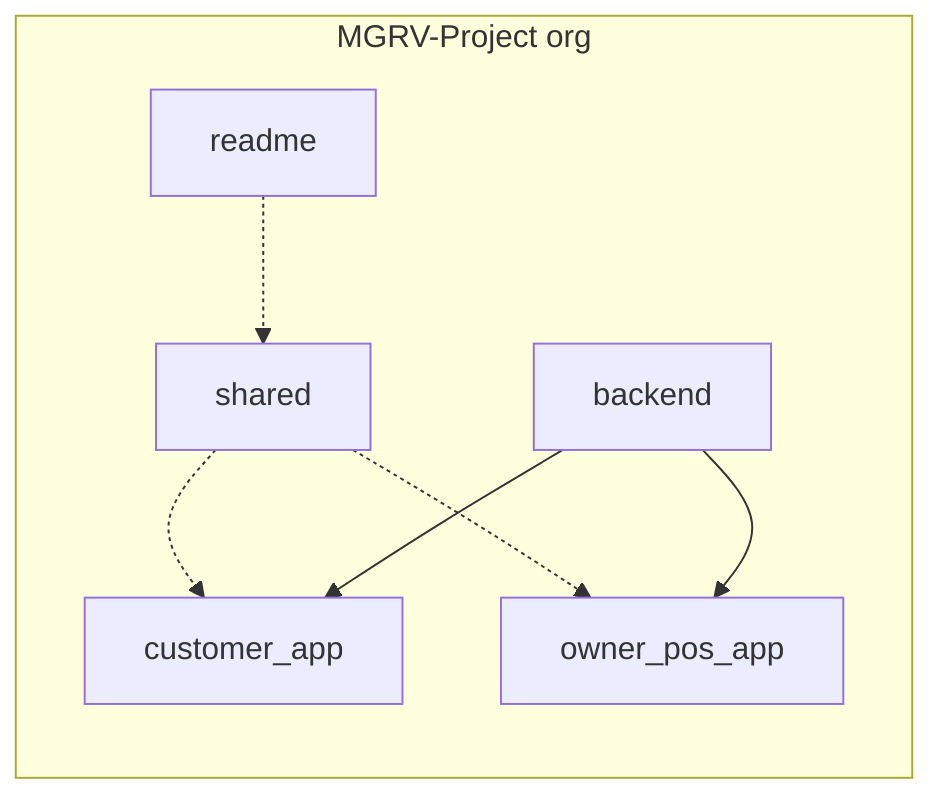
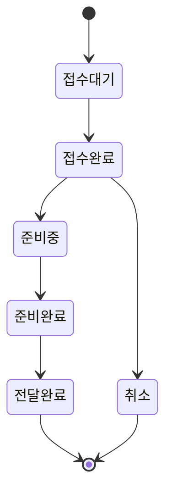

# MGRV Project

## 구성 레포

| 레포 | 내용 |
|---|---|
| [customer_app](https://github.com/MGRV-Project/customer_app) | 고객용 앱 |
| [owner_pos_app](https://github.com/MGRV-Project/owner_pos_app) | 점주·직원용 POS 앱 |
| [backend](https://github.com/MGRV-Project/backend) | 백엔드 |
| [shared](https://github.com/MGRV-Project/shared) | 공통 설계 |
| [readme](https://github.com/MGRV-Project/readme) | 프로젝트 개요 |

## 1. 시스템 구성

## 2. 레포 구조

## 3. 주문 흐름

